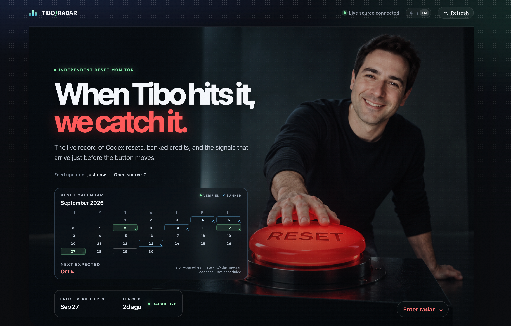

# TIBO / RADAR



An independent, bilingual dashboard for following reported Codex resets, banked reset credits, and related timeline signals. The interface is implemented in [`index.html`](./index.html), [`styles.css`](./styles.css), and [`app.js`](./app.js).

[Live site](https://tibo-radar.vercel.app) · [Timeline API](https://codex-reset.com/api/timeline) · [Report an issue](https://github.com/youngfreeFJS/tibo-radar/issues)

## What it does

- [`app.js`](./app.js) reads the public timeline feed from `https://codex-reset.com/api/timeline` in the browser.
- The client refreshes the feed every 60 seconds and provides a manual refresh control.
- Separates verified hard resets, banked reset credits, and context signals.
- Displays reset history in a calendar and estimates the next date from the median interval between verified hard resets.
- Provides Chinese and English interfaces, with the selected language retained in local storage when available.
- Remains usable with a bundled fallback record if the live request is unavailable.

## Data interpretation

The live API is the source of truth for the dashboard. A forecast is a history-based estimate, not an official schedule or a promise that a reset will occur. Green items denote verified hard resets, blue items denote banked reset credits, and amber items provide context.

TIBO / RADAR is an independent project and is not affiliated with OpenAI.

## Project structure

```text
.
├── assets/
│   ├── tibo-avatar.png            # Timeline profile image
│   ├── tibo-radar-cover.png       # GitHub README cover image
│   └── tibo-reset-hero.png        # Landing-page hero image
├── app.js                          # Data loading, state, i18n, and rendering
├── index.html                      # Page structure
├── styles.css                      # Responsive visual system
└── vercel.json                     # Static deployment and security headers
```

## Run locally

The site has no runtime dependencies or build step. Start any static file server from the repository root:

```bash
python3 -m http.server 4173
```

Open [http://localhost:4173](http://localhost:4173).

## Deploy with Vercel

Vercel can serve the repository without an install command or build command.

1. Import `youngfreeFJS/tibo-radar` in [Vercel](https://vercel.com/new).
2. Leave **Root Directory** at the repository root.
3. Select **Other** as the framework preset.
4. Leave the install command, build command, output directory, and environment variables empty.
5. Deploy.

Vercel uses `main` as its default production branch. See [Vercel Git deployments](https://vercel.com/docs/git) for branch settings. [`vercel.json`](./vercel.json) applies clean URLs and browser security headers. Its Content Security Policy allows browser requests to the timeline API.

## Analytics

[Vercel Web Analytics](https://vercel.com/docs/analytics) can provide page views, anonymized visitors, referrers, countries, and device breakdowns. Enable it in the Vercel project's **Analytics** section, add the Vercel-provided static HTML tracking snippet to `index.html`, then deploy. This repository does not add code to collect raw visitor IP addresses.

## Contributing

1. Create a branch from `main`.
2. Keep visual changes responsive at desktop and mobile widths.
3. Verify the page with a local static server before opening a pull request.
4. Keep reset forecasts labelled as estimates and preserve the independent-project disclaimer.

## License

This project is licensed under the [Apache License 2.0](./LICENSE).
