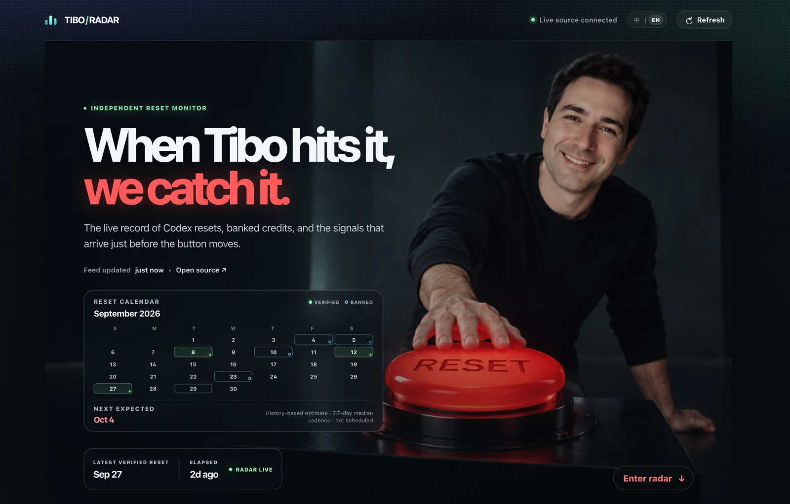
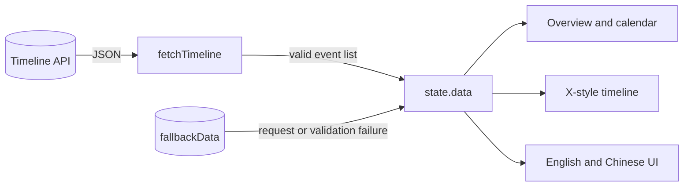

<p align="center">
  <a href="https://tibo-radar.vercel.app">
    
  </a>
</p>

<h1 align="center">TIBO / RADAR</h1>

<p align="center">
  A client-side signal console for reported Codex resets, banked reset credits, and timeline context.
</p>

<p align="center">
  <a href="https://tibo-radar.vercel.app"></a>
  <a href="https://github.com/youngfreeFJS/tibo-radar/blob/main/LICENSE"></a>
  
  
</p>

<p align="center">
  <a href="https://tibo-radar.vercel.app">Live dashboard</a>
  · <a href="https://codex-reset.com/api/timeline">Timeline API</a>
  · <a href="https://github.com/youngfreeFJS/tibo-radar/issues">Issues</a>
</p>

## System profile

| Surface | Implementation |
| --- | --- |
| Runtime | Static HTML, CSS, and browser JavaScript |
| Feed | [`codex-reset.com/api/timeline`](https://codex-reset.com/api/timeline) |
| Poll interval | 60 seconds, with manual refresh |
| UI | English and Chinese, X-style timeline cards, responsive layout |
| Deployment | [Vercel](https://tibo-radar.vercel.app) |
| Fallback | Bundled timeline record when a live request fails |

The interface is implemented in [`index.html`](./index.html), [`styles.css`](./styles.css), and [`app.js`](./app.js). The repository has no package manifest, runtime dependency, or build command.

## Signal path



[`app.js`](./app.js) requests the feed directly from the browser. A response without an event list keeps the bundled fallback record visible. The client recalculates the calendar, timeline, and median-based forecast after each render.

## Bootstrap

The project starts from any static file server:

```bash
git clone https://github.com/youngfreeFJS/tibo-radar.git
cd tibo-radar
python3 -m http.server 4173
```

Open [http://localhost:4173](http://localhost:4173). The page loads the live feed on startup and refreshes it every 60 seconds.

## Repository map

| Path | Responsibility |
| --- | --- |
| [`index.html`](./index.html) | Semantic page structure and event-card template |
| [`styles.css`](./styles.css) | Responsive visual system, calendar, hero, and timeline layout |
| [`app.js`](./app.js) | Feed loading, fallback state, filters, i18n, and rendering |
| [`assets/`](./assets) | Hero, profile, and README images |
| [`vercel.json`](./vercel.json) | Clean URLs and browser security headers |

## Data semantics

- The feed is the dashboard's source of truth when the browser can retrieve it.
- Green marks verified hard resets. Blue marks banked reset credits. Amber marks context signals.
- The forecast uses the median interval between verified hard resets. It is an estimate, not an official schedule.
- The project is independent and is not affiliated with OpenAI.

## Vercel deployment

Vercel can serve this repository without an install command or build command.

1. Import `youngfreeFJS/tibo-radar` in [Vercel](https://vercel.com/new).
2. Keep **Root Directory** at the repository root.
3. Select **Other** as the framework preset.
4. Leave the install command, build command, output directory, and environment variables empty.
5. Deploy.

Vercel uses `main` as its default production branch. See [Vercel Git deployments](https://vercel.com/docs/git) for branch settings. [`vercel.json`](./vercel.json) permits browser requests to the timeline API through its Content Security Policy.

## Analytics

[Vercel Web Analytics](https://vercel.com/docs/analytics) can provide page views, anonymized visitors, referrers, countries, and device breakdowns. Enable it in the Vercel project's **Analytics** section, then add the generated static HTML snippet to `index.html` and deploy. This repository does not add code to collect raw visitor IP addresses.

## Contributing

1. Create a branch from `main`.
2. Test visual changes at desktop and mobile widths.
3. Start a local static server before opening a pull request.
4. Label forecast logic as an estimate and preserve the independent-project disclaimer.

## License

Licensed under the [Apache License 2.0](./LICENSE).
